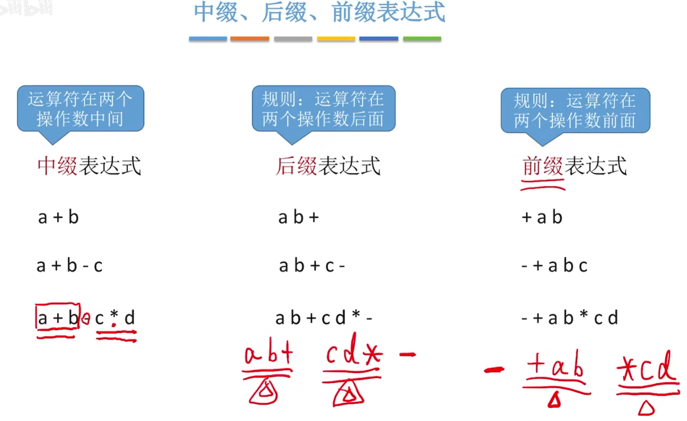

# 线性表的应用

## 栈在括号匹配中的作用


``` CPP
#define MaxSize 10 //定义栈中元素的最大个数
typedef int ElemType;
typedef struct {
    ElemType data[MaxSize]; //静态数组存放栈中元素
    int top; //栈顶指针
} SqStack;

//初始化栈
void InitStack(SqStack& S) {
    S.top = -1;
}

//判断栈是否为空
bool StackEmpty(SqStack& S) {
    if (S.top == -1) {
        return true; //栈为空
    }
    return false; //栈不为空
}

//进栈，若栈S未满，则将x加入使之成为新栈顶
bool Push(SqStack& S, ElemType x) {
    if (S.top == MaxSize - 1) {
        return false;
    }
    S.data[++S.top] = x; // 先++在入栈
    return true;
}

//出栈，若栈S非空，则弹出栈顶元素，并用x返回。
bool Pop(SqStack& S, ElemType x) {
    if (S.top == -1) {
        return false;
    }
    x = S.data[S.top--]; //先出栈，指针再减1
    return true;
}

//读栈顶元素
bool GetTop(SqStack S, ElemType& x) {
    if (S.top == -1) {
        return false;
    }
    x = S.data[S.top]; //x记录栈顶元素
    return true;
}

//括号匹配检查
bool bracketCheck(char str[], int length) {
    SqStack S;
    InitStack(S); //初始化一个栈
    for (int i = 0; i < length; i++) {
        if (str[i] == '(' || str[i] == '{' || str[i] == '[') {
            Push(S, str[i]); //扫描到左括号,入栈
        } else {
            if (StackEmpty(S)) { //扫描到右括号，且当前栈空
                return false; //匹配失败
            }
            char topElem;
            Pop(S, topElem); //栈顶元素出栈
            if (str[i] == ')' && topElem != '(') {
                return false;
            }
            if (str[i] == ']' && topElem != '[') {
                return false;
            }
            if (str[i] == '}' && topElem != '{') {
                return false;
            }
        }
    }
    return StackEmpty(S); //检索完全部括号后,栈空说明匹配成功
}

int main() {
    char str[] = "[(()])";
    int length = sizeof(str) / sizeof(str[0]);
    printf("%d\n", bracketCheck(str, length));
    return 0;
}
```

## 栈在表达式中的应用



后缀表达式，尽量按从左往右的顺序来

中缀转后缀的手算方法：
①确定中缀表达式中各个运算符的运算顺序
②选择下一个运算符，按照「左操作数右操作数运算符」的方式组合成一个新的操作数
③如果还有运算符没被处理，就继续②

用栈实现后缀表达式的计算：
①从左往右扫描下一个元素，直到处理完所有元素
②若扫描到操作数则压入栈，并回到①；否则执行③
③若扫描到运算符，则弹出两个栈顶元素，执行相应运算，运算结果压回栈项，回到①

前缀表达式，尽量按从右往左的顺序来

中缀转前缀的手算方法：
①确定中缀表达式中各个运算符的运算顺序
②选择下一个运算符，按照「运算符左操作数右操作数」的方式组合成一个新的操作数
③如果还有运算符没被处理，就继续②

用栈实现前缀表达式的计算：
①从右往左扫描下一个元素，直到处理完所有元素
②若扫描到操作数则压八栈，并回到①；否则执行③
③若扫描到运算符，则弹出两个栈顶元素，执行相应运算，运算结果压回栈顶，回到①


## 栈在递归中的调用

斐波那契数列求值(复杂度太高)

``` C
int func1(int a) {
    if (a == 0) {
        return 1;
    } else if (a == 1) {
        return 1;
    } else {
        return func1(a - 1) + func1(a - 2);
    }
}
```


## 队列的应用

树的层次遍历 (以后会学)

图的广度优先遍历(以后会学)

队列在操作系统的应用 FCFS (先来先服务)  eg: 打印缓冲区

## 特殊矩阵的压缩存储


