# 树与二叉树

## 树

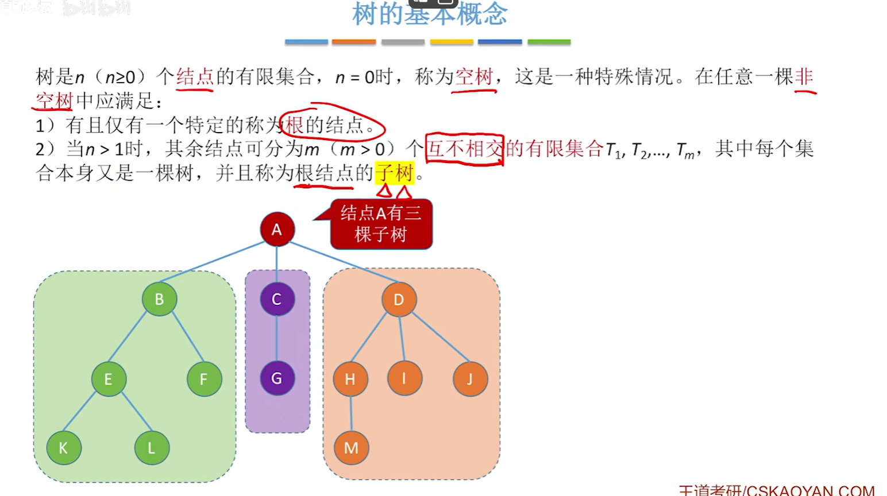

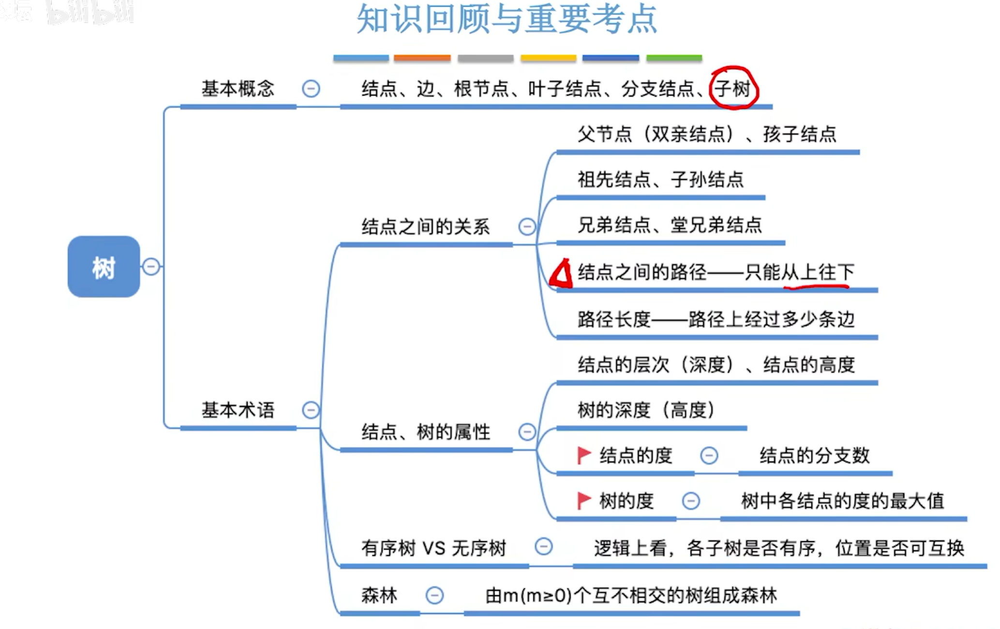

1) 树的结点数n等于所有结点的度数之和$+1$。
2) 度为m的树中第i层上至多有$m^{i-1}$个结点(i≥1)。
3) 高度为h的m叉树至多有$\dfrac{m^h-1}{m-1}$个结点。
4) 度为m、具有n个结点的树的最小高度$h_{min}=\lceil\log_m(n(m-1)+1)\rceil$。
5) 度为m、具有n个结点的树的最大高度$h=n-m+1$。

## 二叉树

### 定义和基本概念和存储结构

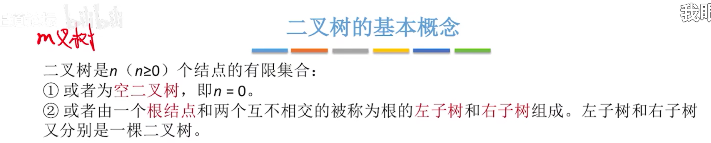

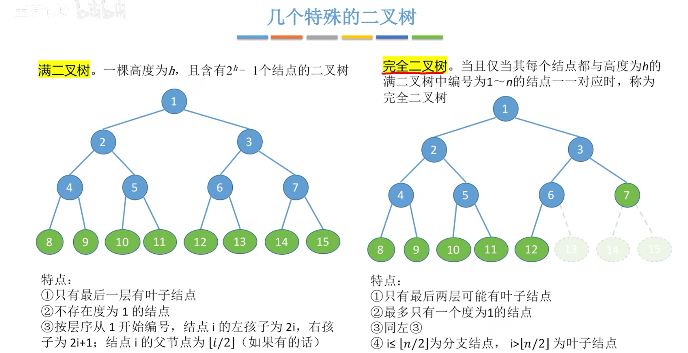

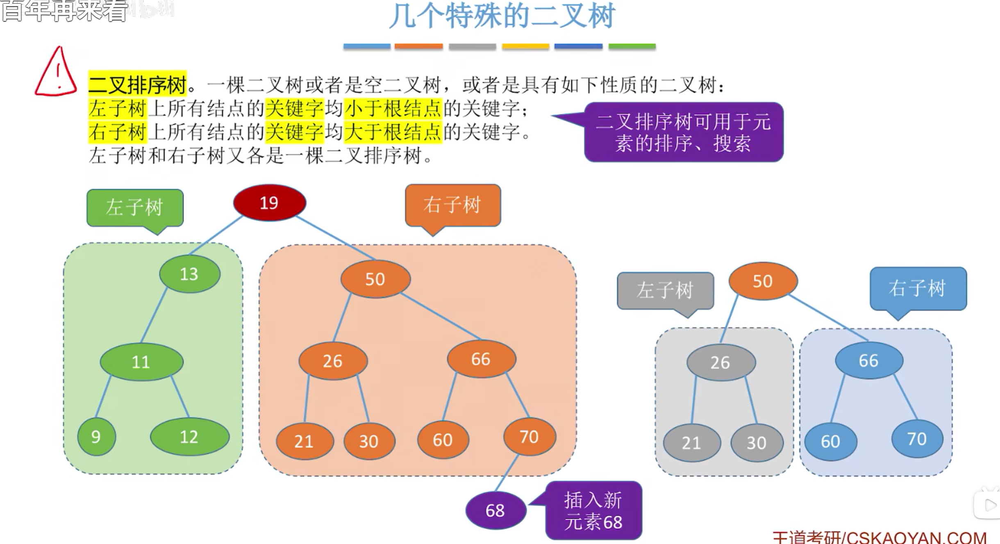

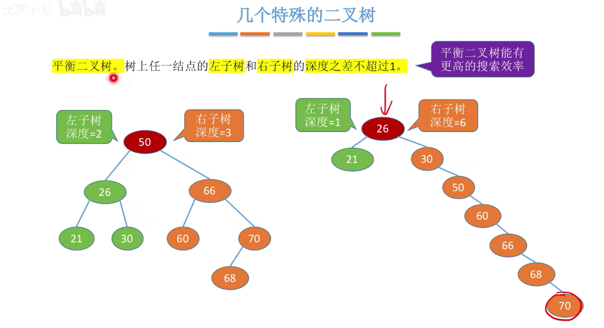

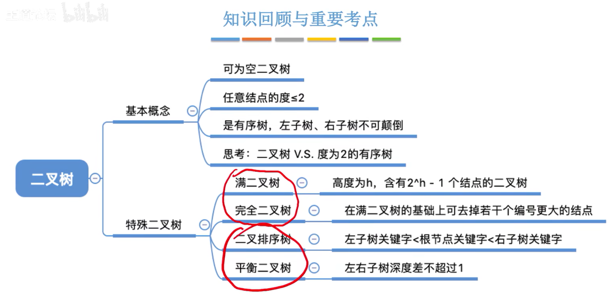

1) $n=n_0+n_1+n_2$     $n=n_1+2n_2+1$     $\Rightarrow n_0=n_2+1$​
2) m层二叉树至多有$m^{i-1}$个节点$(i\geq1)$      等比数列求和公式 $a+aq+aq^2+\ldots+aq^{n-1}=\dfrac{a(1-q^n)}{1-q}$​
3) 高度为h的2叉树至多有$2^h-1$个结点，具有n个(n>0)节点的完全二叉树的高度h为 $\lceil \log_2(n+1) \rceil$ 或 $\lfloor \log_2 n \rfloor+1$ ​
4) 若完全二叉树有$2k$个结点,则必有$n_1=1,n_0=k,n_2=k-1$,若完全二叉树有$2k-1$个结点则必有$n_1=0,n_0=k,n_2=k-1$ !!!

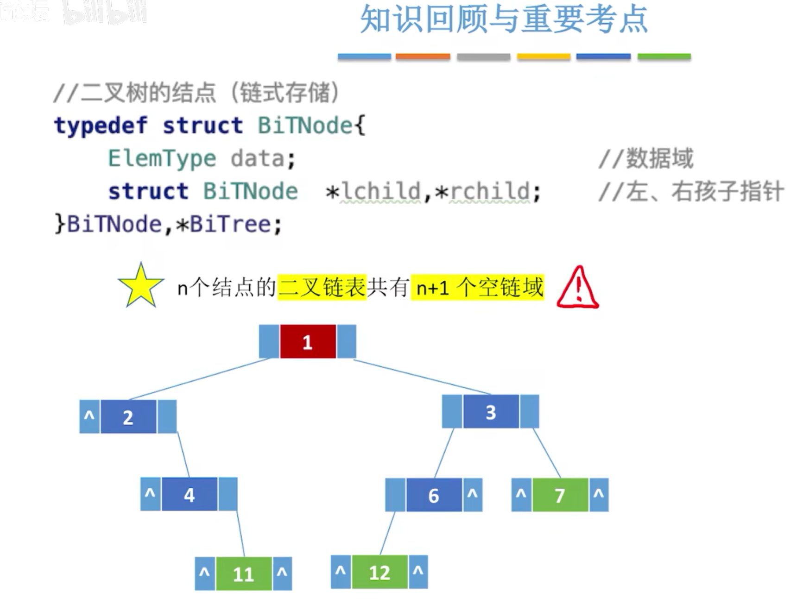

```c++
// 二叉树的二叉链表结点结构定义
typedef struct BiTNode{
    ElemType data;  // 结点数据
    BiTNode *left;  // 左孩子指针
    BiTNode *right;  // 右孩子指针
}BiTNode, *BiTree;
```

## 二叉树的遍历

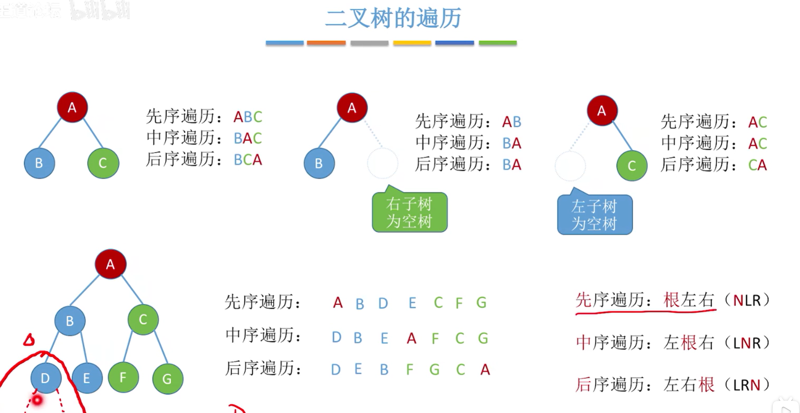

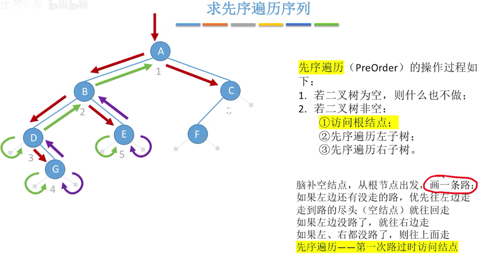

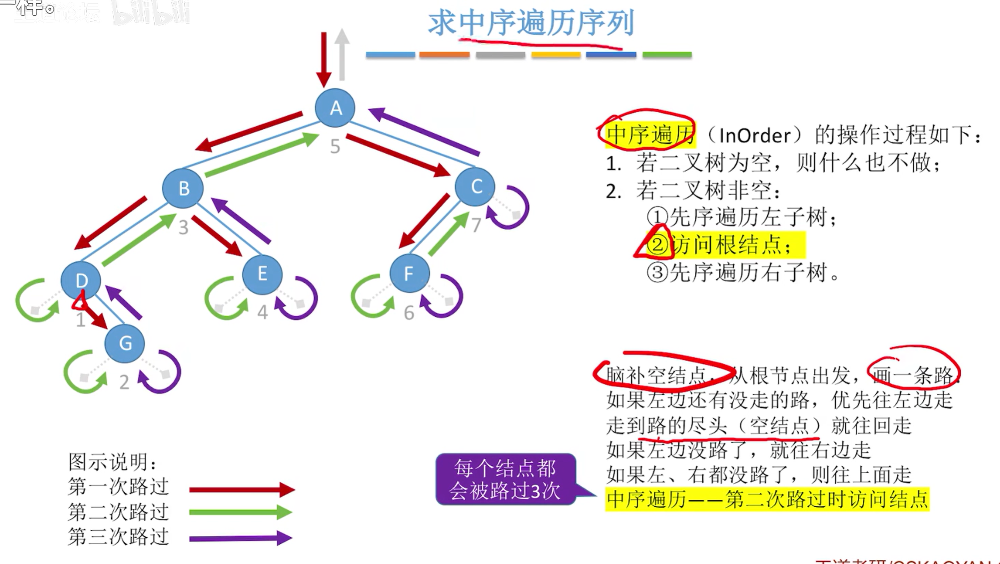

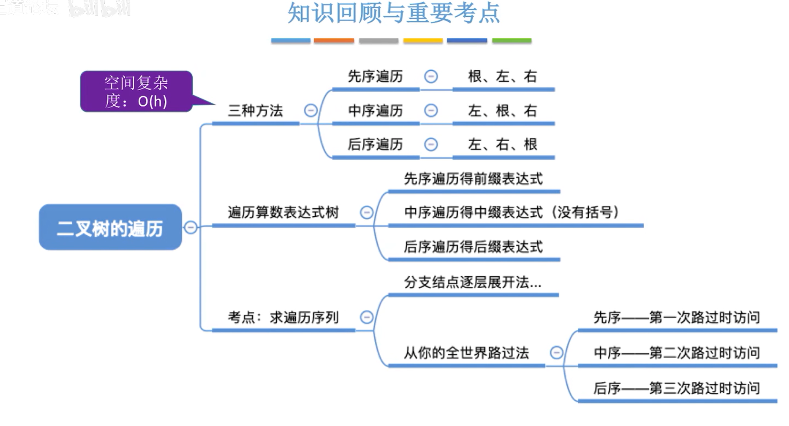

```c++
// 二叉树的前序遍历递归算法
void PreOrder(BiTree T) {
    if (T != NULL) {
        printf("%c", T->data); // 显示结点数据
        PreOrder(T->left); // 再先序遍历左子树
        PreOrder(T->right); // 最后先序遍历右子树
    }
}

// 二叉树的中序遍历递归算法
void InOrder(BiTree T) {
    if (T != NULL) {
        InOrder(T->left); // 中序遍历左子树
        printf("%c", T->data); // 显示结点数据
        InOrder(T->right); // 最后中序遍历右子树
    }
}

// 二叉树的后序遍历递归算法
void PostOrder(BiTree T) {
    if (T != NULL) {
        PostOrder(T->left); // 后序遍历左子树
        PostOrder(T->right); // 后序遍历右子树
        printf("%c", T->data); // 显示结点数据
    }
}
```

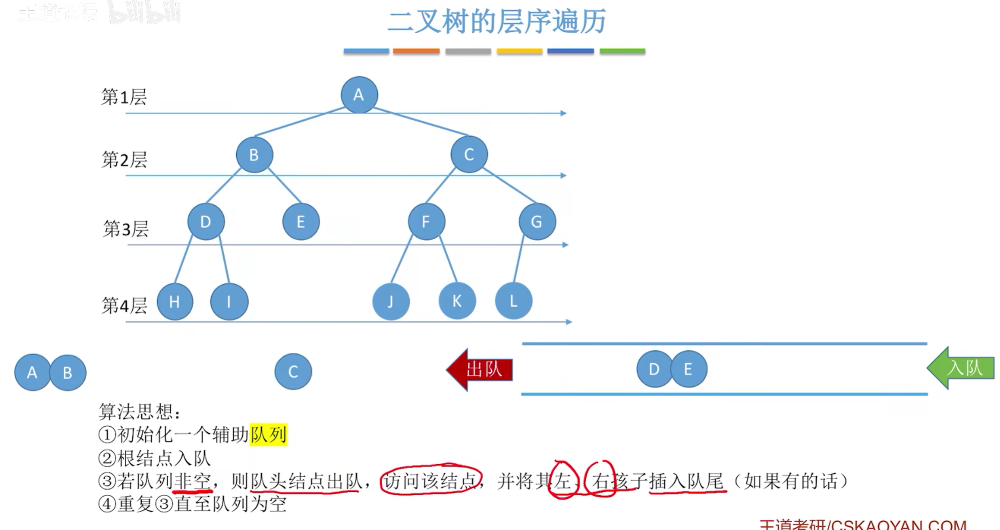

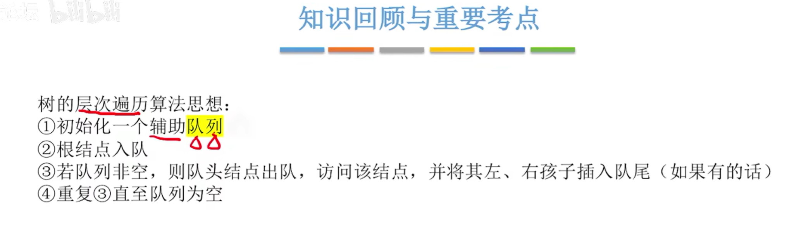

```cpp
// 二叉树的层次遍历
void LevelOrder(BiTree T) {
    BiTree p;
    BiTree qu[MaxSize]; // 定义一个顺序栈
    int front = 0, rear = 0; // 初始化队首和队尾指针
    if (T != NULL) {
        rear = (rear + 1) % MaxSize; // 入队
        qu[rear] = T; // 根结点入队
        while (front != rear) { // 队列不空
            front = (front + 1) % MaxSize; // 出队
            p = qu[front]; // 出队结点
            printf("%c", p->data); // 显示结点数据
            if (p->left != NULL) {
                rear = (rear + 1) % MaxSize; // 入队
                qu[rear] = p->left; // 左孩子入队
            }
            if (p->right != NULL) {
                rear = (rear + 1) % MaxSize; // 入队
                qu[rear] = p->right; // 右孩子入队
            }
        }
    }
}
```

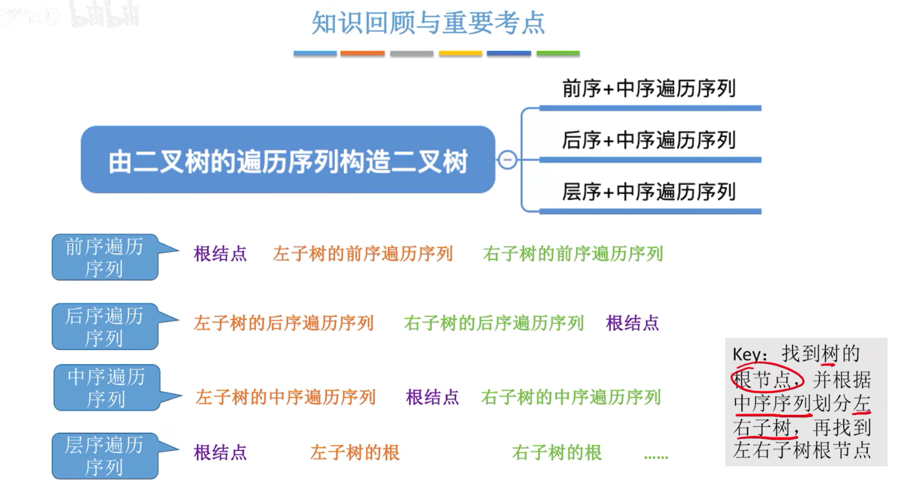

必须有中序列

### 线索二叉树

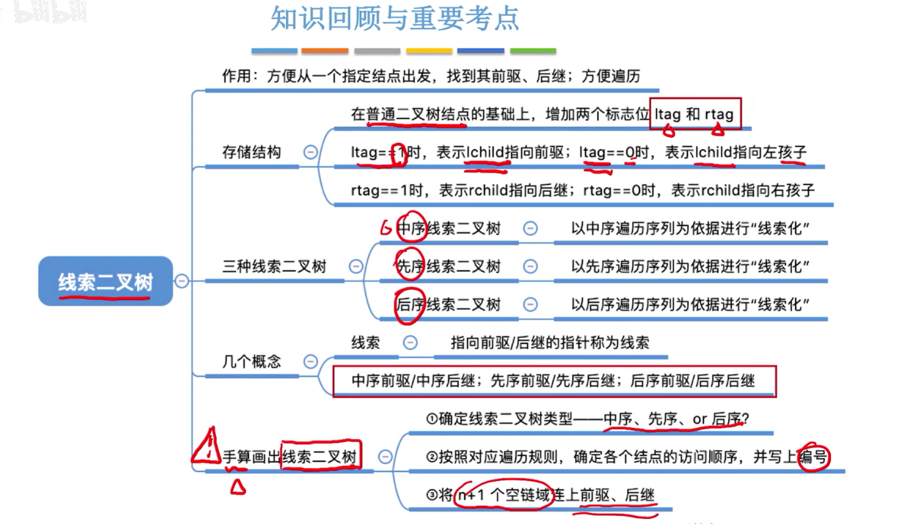

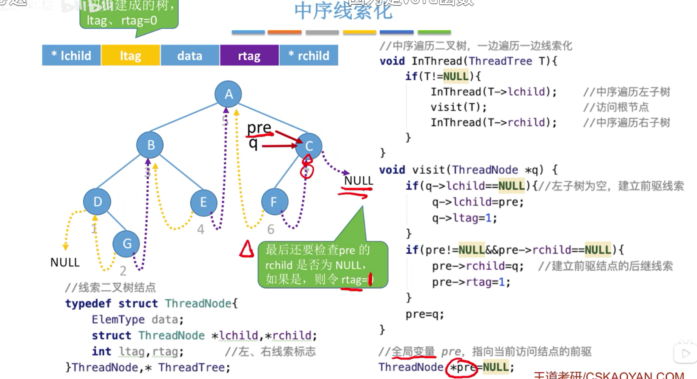

```C
// 中序线索化
ThreadNode* pre = NULL; // 全局变量pre，初始为NULL
// 线索二叉树的二叉链表结点结构定义
typedef struct ThreadNode {
    ElemType data; // 结点数据
    struct ThreadNode *left, *right; // 左右孩子指针
    int ltag, rtag; // 左右线索标志
} ThreadNode, *ThreadTree;

//中序线索化二叉树
void CreateInThread(ThreadTree T) {
    pre = NULL; // 初始为NULL
    if (T != NULL) { // 非空二叉树才能线索化
        InThread(T); // 中序线索化二叉树
        if (pre->right == NULL) { // 处理遍历的最后一个结点
            pre->rtag = 1; // 建立后继线索
        }
    }
}

// 访问节点q
void visit(ThreadNode* q) {
    if (!q->left) { // 没有左孩子
        q->ltag = 1; // 建立前驱线索
        q->left = pre; // 前驱线索
    }
    if (pre != NULL && !pre->right) { // 没有右孩子
        pre->rtag = 1; // 建立后继线索
        pre->right = q; // 后继线索
    }
    pre = q; // 标记当前结点为刚刚访问过的结点
}

// 中序遍历进行中序线索化
void InThread(ThreadTree T) {
    if (T != NULL) {
        InThread(T->left); // 递归左子树线索化
        visit(T); // 访问当前结点
        InThread(T->right); // 递归右子树线索化
    }
}
```

