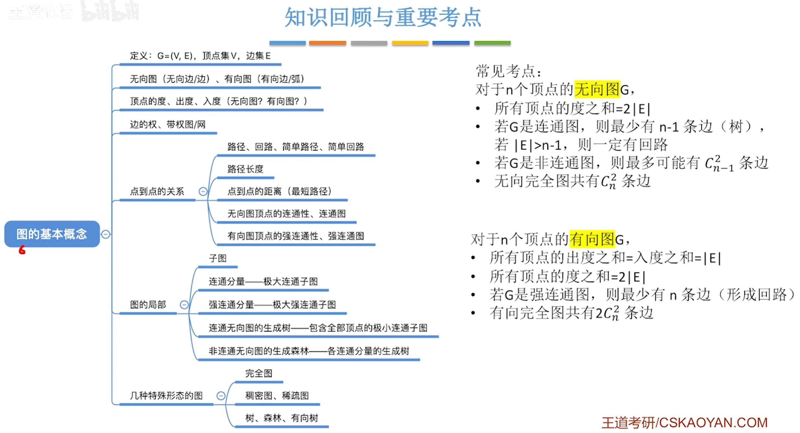
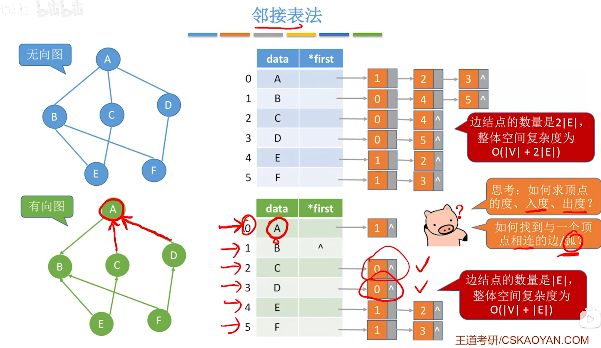
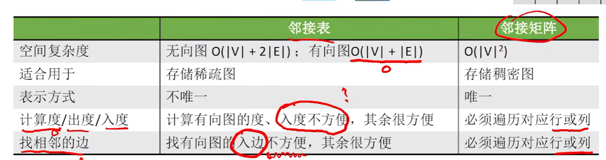
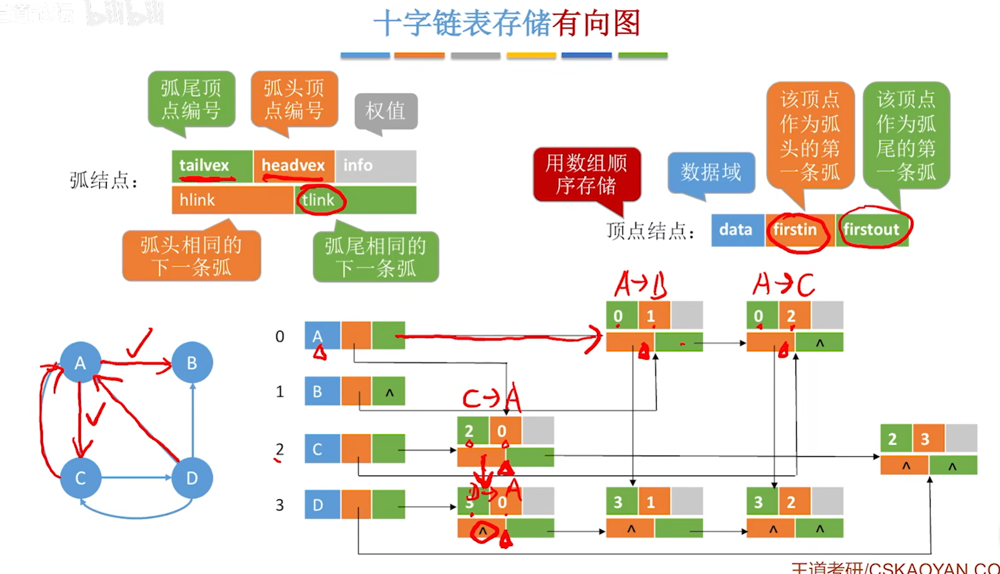
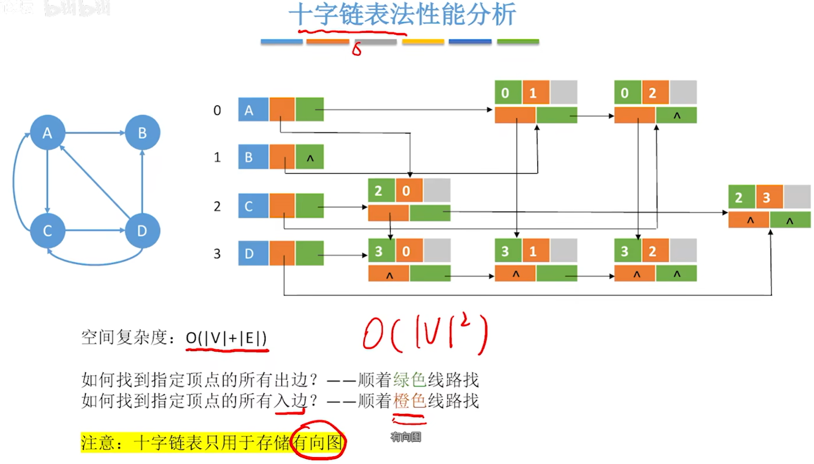
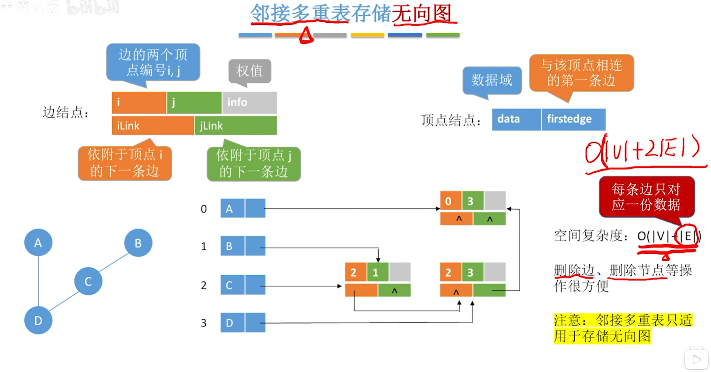
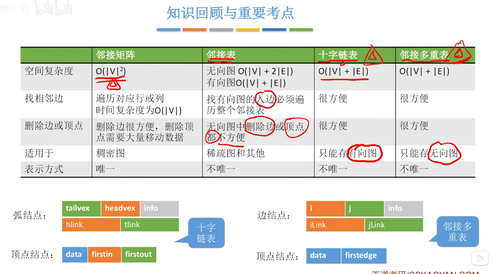
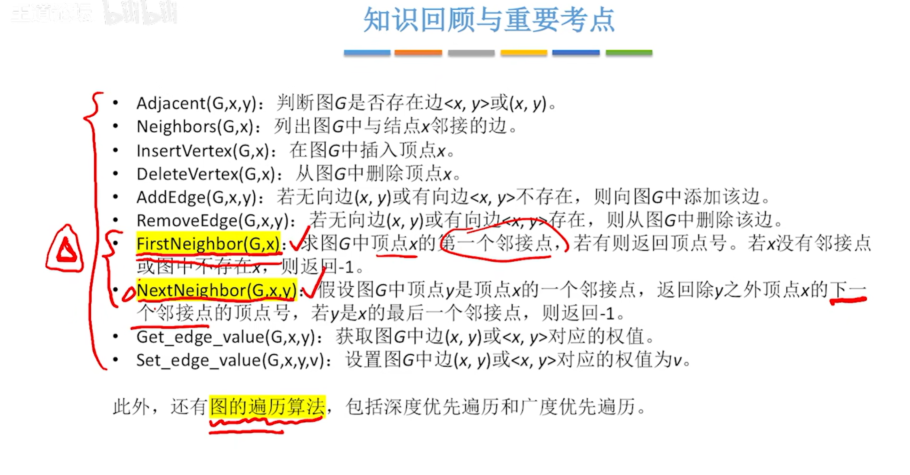

# 图

## 概念

### 图的基本概念



## 图的表示法

### 邻接矩阵法

空间复杂度：$O(|V|^2)$一一只和顶点数相关，和实际的边数无关
适合用于存储稠密图
无向图的邻接矩阵是对称矩阵，可以压缩存储（只存储上三角区/下三角区）

设图G的邻接矩阵为$\Alpha$(矩阵元素为0/1)，则$A^n$的元素$A^n[i][j]$等于由顶点到顶点的长度为$n$​的路径的数目

```c
#define MaxVertexNum 100 // 邻接表的最大顶点数
#define INFINITY 65535 // 定义无穷大
typedef char VertexType; // 顶点的数据类型
typedef int EdgeType; // 边的权值类型

// 邻接矩阵
typedef struct {
    VertexType vexs[MaxVertexNum]; // 顶点
    EdgeType edges[MaxVertexNum][MaxVertexNum]; // 边的权值
    int vexnum, arcnum; // 图的当前顶点数和边数
} MGraph;
```


### 邻接表法





```C
// 边表节点
typedef struct ArcNode {
    int adjvex; // 邻接点域，存储该顶点对应的下标
    struct ArcNode* nextarc; // 指向下一个邻接点的指针
    EdgeType weight; // 边的权值
} ArcNode;

// 顶点表结点
typedef struct VNode {
    VertexType data; // 顶点信息
    ArcNode* first; // 指向第一个邻接点
} VNode, AdjList[MaxVertexNum];

typedef struct {
    AdjList vertices; // 邻接表
    int vexnum, arcnum; // 图的顶点数和边数
} ALGraph;
```

### 十字链表和临界多重表









### 图的基本操作



1. Adjacent(G,x,y):邻接矩阵 O(1),邻接表O(1)~O(|V|)

2. Neighbors(G,x):邻接矩阵 O(1),邻接表:出边O(1)~O(|V|),入边O(|E|)

3. InsertVertex(G,x):邻接矩阵 O(1),邻接表:O(1)

4. DeleteVertex(G,x):邻接矩阵O(|V|),邻接表O(1)~O(|E|)

5. AddEdge(G,x,y):邻接矩阵O(|V|),邻接表O(1)~O(|V|)

6. FirstNeighbor(G,x):邻接矩阵O(1)~O(|V|),找入边O(1),找出边O(1)~O(|E|)

7. NextNeighbor(G,x,y):邻接矩阵O(1)~O(|V|),O(1)
