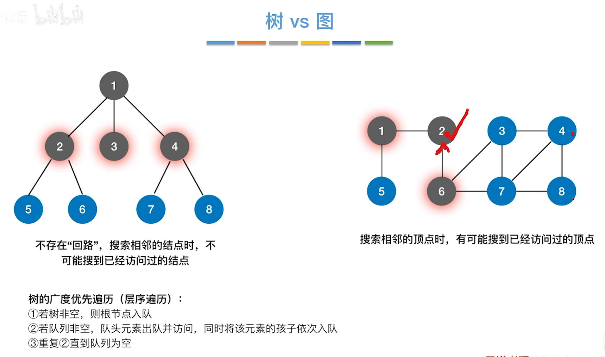
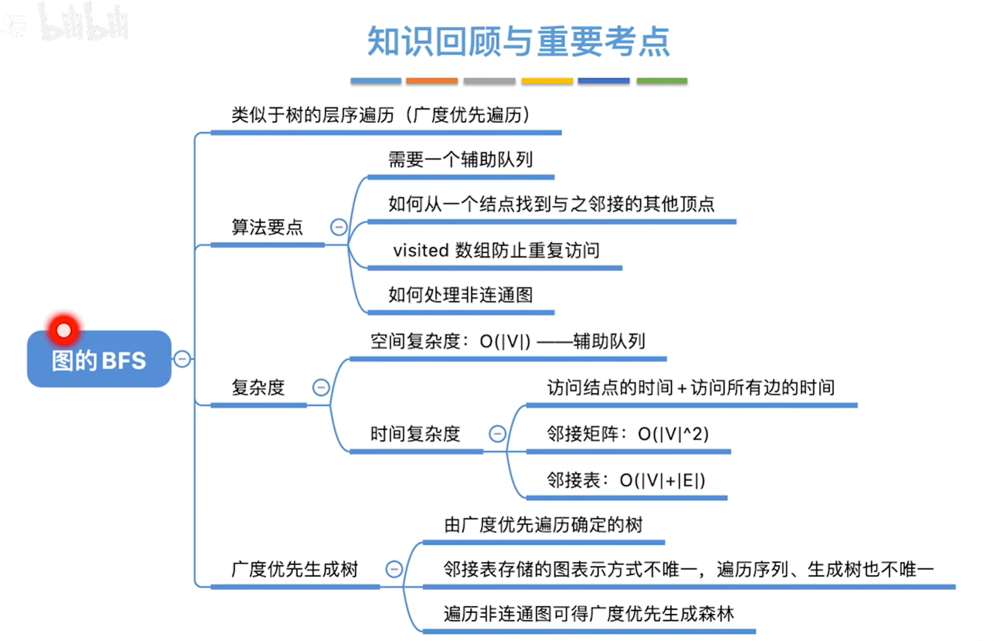
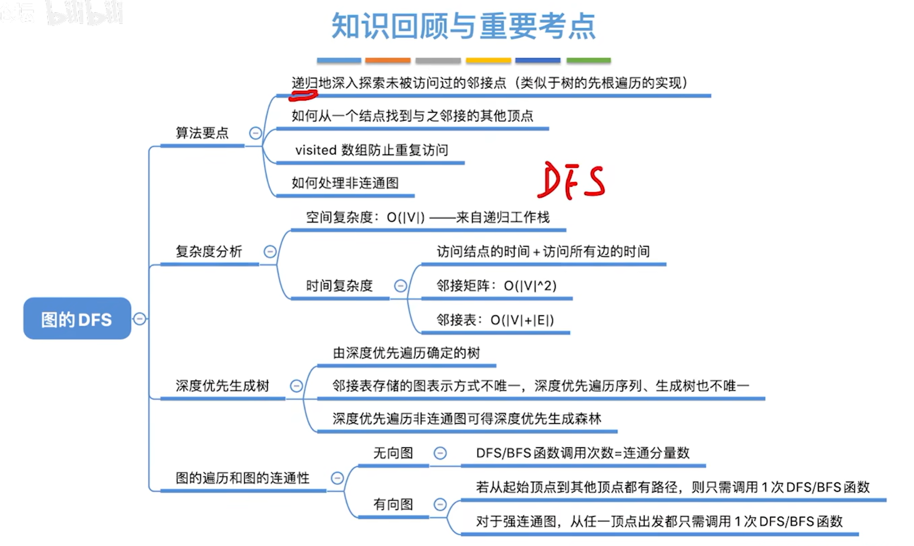
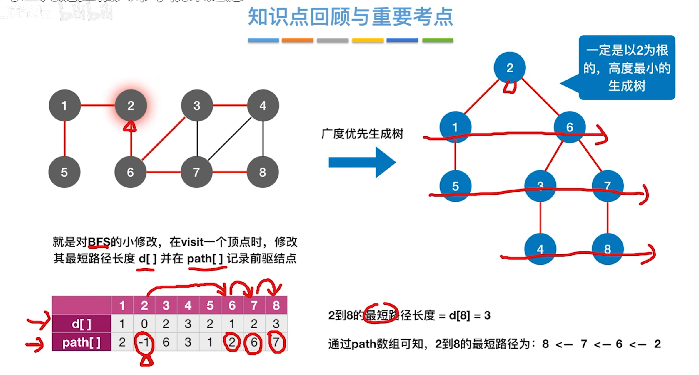
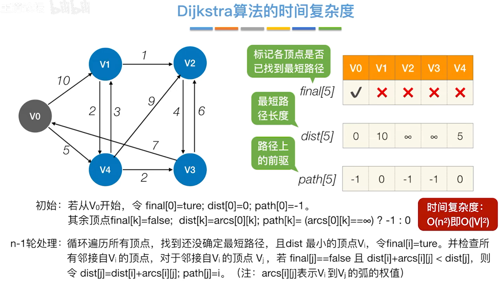
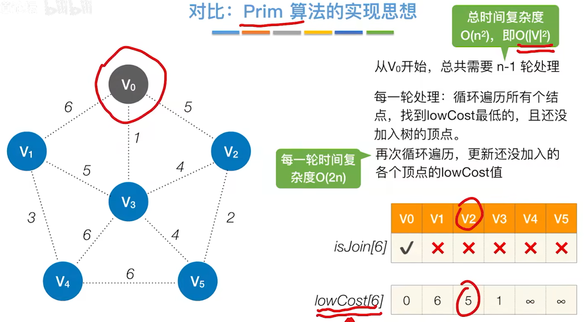

# 图

## 概念

### 图的基本概念


## 图的表示法

### 邻接矩阵法

空间复杂度：$O(|V|^2)$一一只和顶点数相关，和实际的边数无关
适合用于存储稠密图
无向图的邻接矩阵是对称矩阵，可以压缩存储（只存储上三角区/下三角区）

设图G的邻接矩阵为$\Alpha$(矩阵元素为0/1)，则$A^n$的元素$A^n[i][j]$等于由顶点到顶点的长度为$n$​的路径的数目

```c
#define MaxVertexNum 100 // 邻接表的最大顶点数
#define INFINITY 65535 // 定义无穷大
typedef char VertexType; // 顶点的数据类型
typedef int EdgeType; // 边的权值类型

// 邻接矩阵
typedef struct {
    VertexType vexs[MaxVertexNum]; // 顶点
    EdgeType edges[MaxVertexNum][MaxVertexNum]; // 边的权值
    int vexnum, arcnum; // 图的当前顶点数和边数
} MGraph;
```


### 邻接表法


```C
// 边表节点
typedef struct ArcNode {
    int adjvex; // 邻接点域，存储该顶点对应的下标
    struct ArcNode* nextarc; // 指向下一个邻接点的指针
    EdgeType weight; // 边的权值
} ArcNode;

// 顶点表结点
typedef struct VNode {
    VertexType data; // 顶点信息
    ArcNode* first; // 指向第一个邻接点
} VNode, AdjList[MaxVertexNum];

typedef struct {
    AdjList vertices; // 邻接表
    int vexnum, arcnum; // 图的顶点数和边数
} ALGraph;
```

### 十字链表和临界多重表


### 图的基本操作


1. Adjacent(G,x,y):邻接矩阵 O(1),邻接表O(1)~O(|V|)

2. Neighbors(G,x):邻接矩阵 O(1),邻接表:出边O(1)~O(|V|),入边O(|E|)

3. InsertVertex(G,x):邻接矩阵 O(1),邻接表:O(1)

4. DeleteVertex(G,x):邻接矩阵O(|V|),邻接表O(1)~O(|E|)

5. AddEdge(G,x,y):邻接矩阵O(|V|),邻接表O(1)~O(|V|)

6. FirstNeighbor(G,x):邻接矩阵O(1),O(|V|),找入边O(1),找出边O(1)~O(|E|)

7. NextNeighbor(G,x,y):邻接矩阵O(1)~O(|V|),O(1)

## 图的遍历

### 广度优先遍历 BFS





```C
#define MaxVertexNum 100 // 图中顶点数目的最大值
bool visited[MaxVertexNum]; // 访问标志数组
// 对图G进行广度优先遍历
void BFSTraverse(ALGraph G) {
    for (int i = 0; i < G.vexnum; i++) {
        visited[i] = false; // 初始化访问标志数组
    }
    initQueue(Q); // 初始化辅助队列
    for (int i = 0; i < G.vexnum; i++) { // 从0号开始遍历
        if (!visited[i]) {
            BFS(G, i); // 若是未访问过就进行BFS
        }
    }
}

// 广度优先遍历
bool BFS(ALGraph G, int v) {
    visit(v); // 访问初始顶点v
    visited[v] = true; // 对v做已访问标记
    Enqueue(Q, v); // 顶点v入队列
    while (!IsEmpty(Q)) {
        Dequeue(v); // 顶点v出队列
        for (w = FirstNeighbor(G, v); w >= 0; w = NextNeighbor(G, v, w)) {
            if (!visited[w]) {
                visit(w); // 访问顶点w
                visited[w] = true; // 对w做已访问标记
                Enqueue(w); // 顶点w入队列
            }
        }
    }
    return true;
}
```

### 深度优先遍历 DFS



```C
// 深度优先遍历
bool visited[MaxVertexNum]; // 访问标志数组
void DFSTraverse(ALGraph G) {
    for (int i = 0; i < G.vexnum; i++) {
        visited[i] = false; // 初始化访问标志数组
    }
    for (int i = 0; i < G.vexnum; i++) { // 从0号开始遍历
        if (!visited[i]) {
            DFS(G, i); // 若是未访问过就进行DFS
        }
    }
}
// 深度优先遍历 邻接表
void DFS(ALGraph G, int v) {
    visit(v); // 访问初始顶点v
    visited[v] = true; // 对v做已访问标记
    for (p = G.vertices[i].firstarc; p; p = p->nextarc) { // 对每个顶点循环调用DFS
        j = p->adjvex; // j为顶点i的邻接点
        if (!visited[j]) {
            DFS(G, j); // 对未访问的邻接顶点递归调用DFS
        }
    }
    return true;
}
// 深度优先遍历 邻接矩阵
void DFS(ALGraph G, int v) {
    visit(v); // 访问初始顶点v
    visited[v] = true; // 对v做已访问标记
    for (int j = 0; j < G.vexnum; j++) {
        if (visited[j] == false && G.arcnum[v][j] == 1) {
            DFS(G, j); // 对v的尚未访问的邻接顶点w递归调用DFS
        }
    }
}
```

## 图的应用

### 最小生成树


### 最短路径

#### BFS



```c
// 求顶点u到其他顶点的最短路径
void BFS_MIN_Distance(ALGraph G, int u) {
    // d[i]表示从u到i结点的最短路径
    for (int i = 0; i < G.vexnum; i++) {
        visited[i] = false; // 初始化访问标志数组
        path[i] = -1; // 初始化路径数组
        distance[i] = INFINITY; // 初始化距离数组
    }
    initQueue(Q); // 初始化辅助队列
    visit(u); // 访问初始顶点u
    visited[u] = true; // 对u做已访问标记
    distance[u] = 0; // 初始顶点到自身的距离为0
    Enqueue(Q, u); // 顶点u入队列
    while (!IsEmpty(Q)) {
        Dequeue(u); // 顶点v出队列
        for (w = FirstNeighbor(G, u); w >= 0; w = NextNeighbor(G, u, w)) {
            if (!visited[w]) {
                visit(w); // 访问顶点w
                path[w] = u; // 记录路径
                distance[w] = distance[u] + 1; // 更新顶点w的距离
                visited[w] = true; // 对w做已访问标记
                Enqueue(w); // 顶点w入队列
            }
        }
    }
}
```

#### Dijkstra





不适用于带负权值的图

#### Floyd
