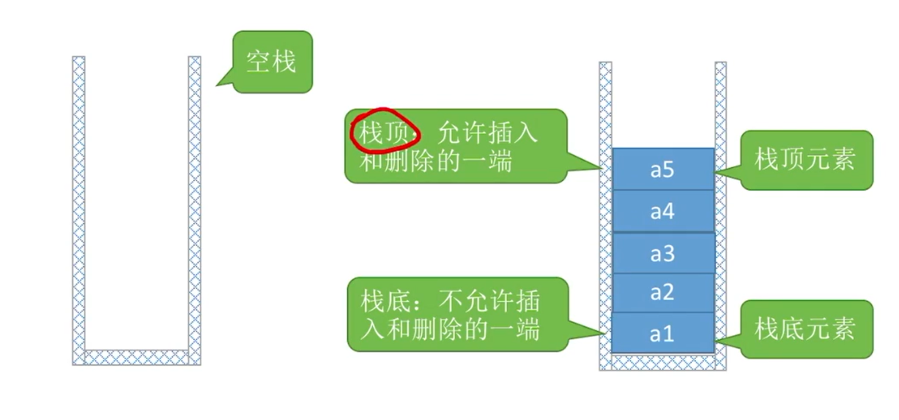
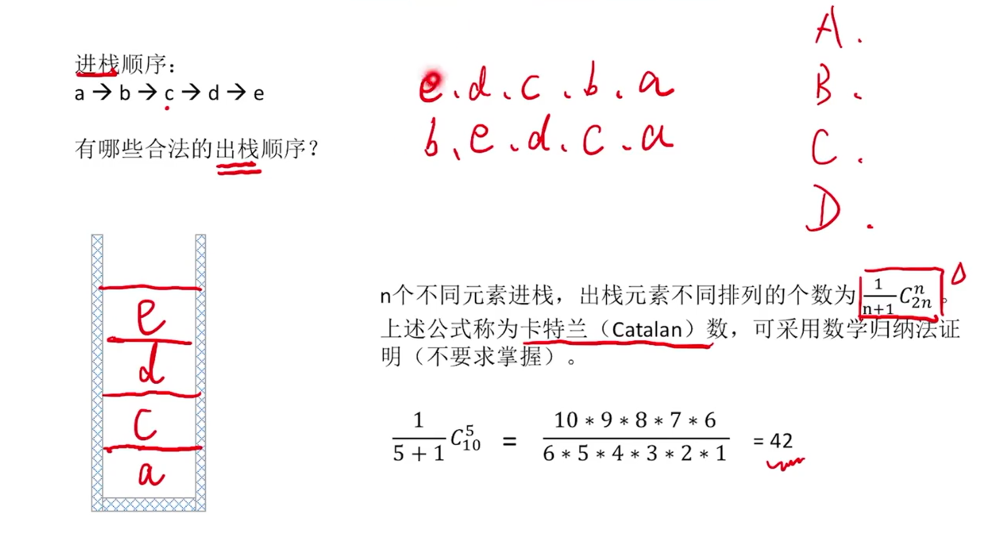
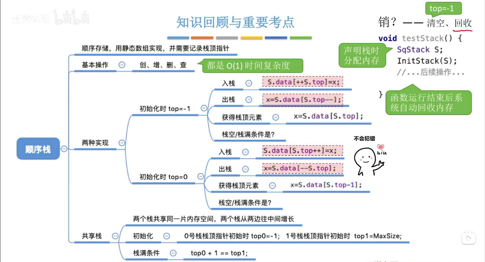
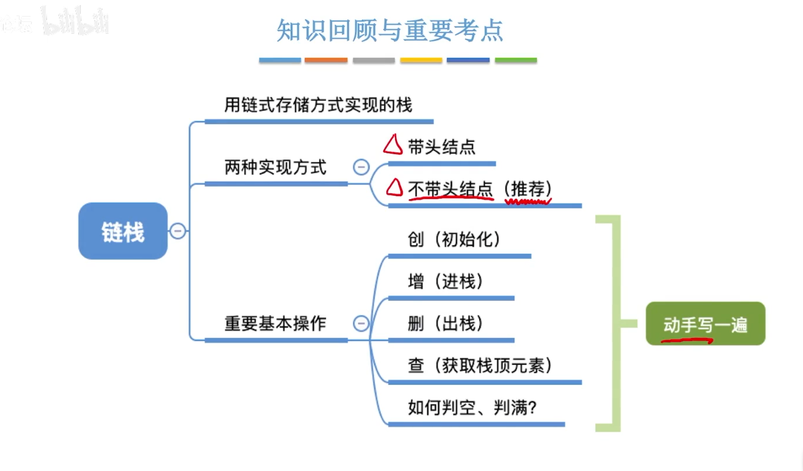
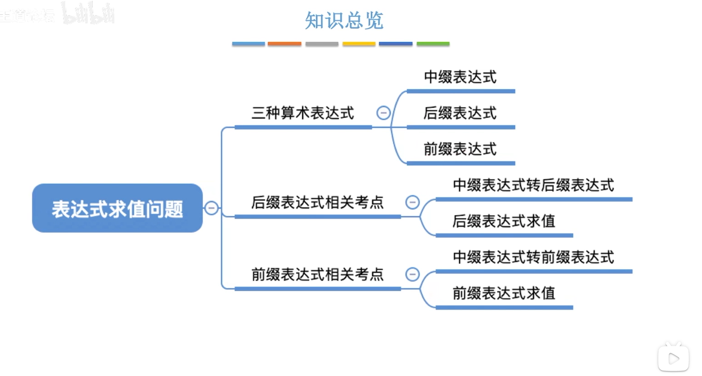

# 栈(stack)

线性表是具有相同数据类型的n(n≥0)个数据元素的有限序列，其中n为表长，当n=0时线性表是一个空表。若用命名线性表，则其一般表示为

L=(a1,a2…,ai,ai+1,…,an)  
栈(stack)是只允许**一端**进行插入或删除的线性表  
重要术语: **空栈，栈底，栈顶**
  
特点:**后进先出**(LIFO)  

## 栈的基本操作

+ InitStack(&S);//**初始化**栈。构造一个空栈S,分配内存空间。  
+ DestroyStack(&L);//**销毁**栈。销毁并释放栈S所占用的内存空间。  
+ Push(&S,x);//**进栈**，若栈S未满，则将x加入使之成为新**栈顶**  
+ Pop(&S,&x);//**出栈**，若栈S非空，则弹出**栈顶**元素，并用x返回。  
+ GetTop(S,&x);//**读栈顶元素**。若栈S非空，则用x返回**栈顶**元素,**不弹出**  

## 栈的常考题型

### 出栈顺序  



### 栈的顺序存储实现

``` C
#define MaxSize 10 //定义栈中元素的最大个数
typedef int ElemType;
typedef struct {
    ElemType data[MaxSize]; //静态数组存放栈中元素
    int top;//栈顶指针
} SqStack;
```

### 初始化栈  

``` C
void InitStack(SqStack &s){
    s.top=-1;
}
```

### 判断栈是否为空  

``` C
bool StackEmpty(SqStack *S){
    if (S->top==-1){
        return true; //栈为空
    }
    return false; //栈不为空
}
```

### 新元素入栈  

``` C
bool Push(SqStack *S,ElemType x){
    if (S->top=MaxSize-1){
        return false; 
    }
    S->data[++S->top]=x;
    return true;
}
```

### 出栈操作  

``` C
bool Pop(SqStack *S,ElemType x){
    if (S->top=-1){
        return false; 
    }
    x=S->data[S->top--];
    return true;
}
```

栈满的条件： top==MaxSize  

### 顺序栈的缺点  

栈的大小不可改变  

### 共享栈

两个栈共享一片存储空间

``` C
#define MaxSize 10 //定义栈中元素的最大个数
typedef int ElemType;
typedef struct {
    ElemType data[MaxSize]; //静态数组存放栈中元素
    int top0;//0号栈栈顶指针
    int top1;//1号栈栈顶指针
} ShStack;
```

### 初始化共享栈

``` C
void InitStack(ShStack &s){
    s.top0=-1;
    s.top1=MaxSize;
}
```

栈满的条件： top0+1==top1  

### 小结

  

## 栈的链式存储实现  

``` C
typedef int ElemType;
typedef struct LinkNode{
    ElemType data;
    struct LinkNode *next;
} *LinkList;
```

### 小结(链栈)



## 栈的应用

### 栈在括号匹配中的应用

[代码文件](test08.c)

``` c
#include <stdio.h>
#include <stdlib.h>
#include <stdbool.h>
#define MaxSize 10 //定义栈中元素的最大个数
typedef struct {
    int data[MaxSize]; //静态数组存放栈中元素
    int top;//栈顶指针
} SqStack;

//初始化栈
void InitStack(SqStack *S){

}

//判断栈是否为空
bool StackEmpty(SqStack S){

}

//新元素入栈
bool Push(SqStack *S,char x){

}

//栈顶元素出栈,用x返回
bool Pop(SqStack *S,char *x){

}

bool bracketCheck(char str[],int length){
    SqStack S;
    InitStack(&S); //初始化一个栈
    for (int i=0;i<length;i++){
        if (str[i]=='('||str[i]=='{'||str[i]=='['){
            Push(&S,str[i]); //扫描到左括号,入栈
        } else {
            if (StackEmpty(S)){ //扫描到右括号，且当前栈空
                return false; //匹配失败
            }
            char topElem;
            Pop(&S,&topElem); //栈顶元素出栈
            if (str[i]==')'&&topElem != '('){
                return false;
            }
            if (str[i]==']'&&topElem != '['){
                return false;
            }
            if (str[i]=='}'&&topElem != '{'){
                return false;
            }
        }
    }
    return StackEmpty(S); //检索完全部括号后,栈空说明匹配成功
}

void test (){

}
int main (){

}
```


### 表达式求值



[](https://imgse.com/i/z9jEwD)  

[](https://imgse.com/i/zCpZRJ)  

[](https://imgse.com/i/zCCcbq)  

[](https://imgse.com/i/zCCD2Q)  
