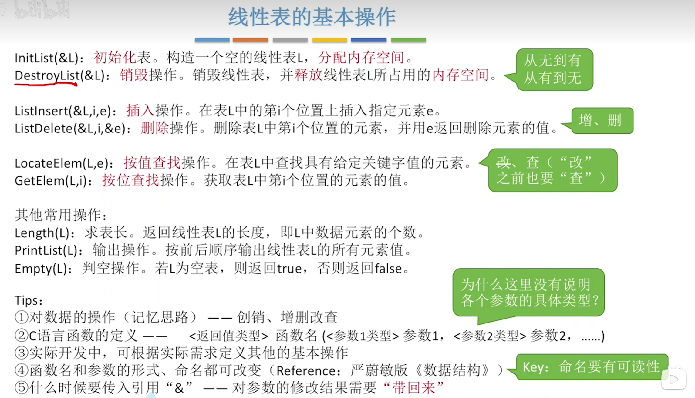
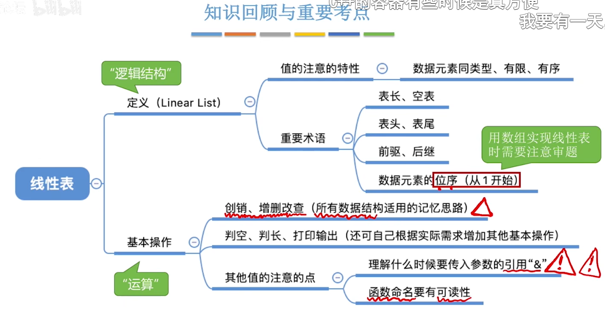
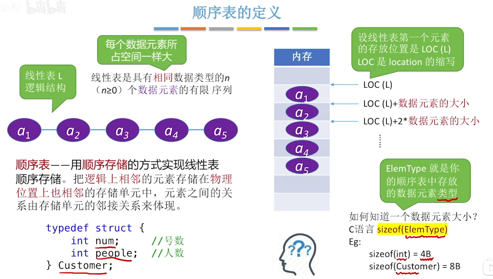
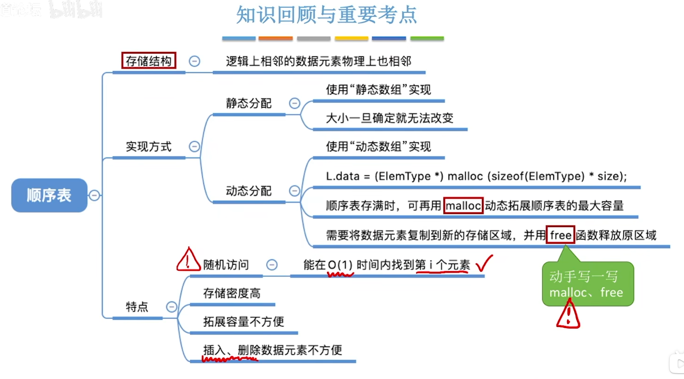
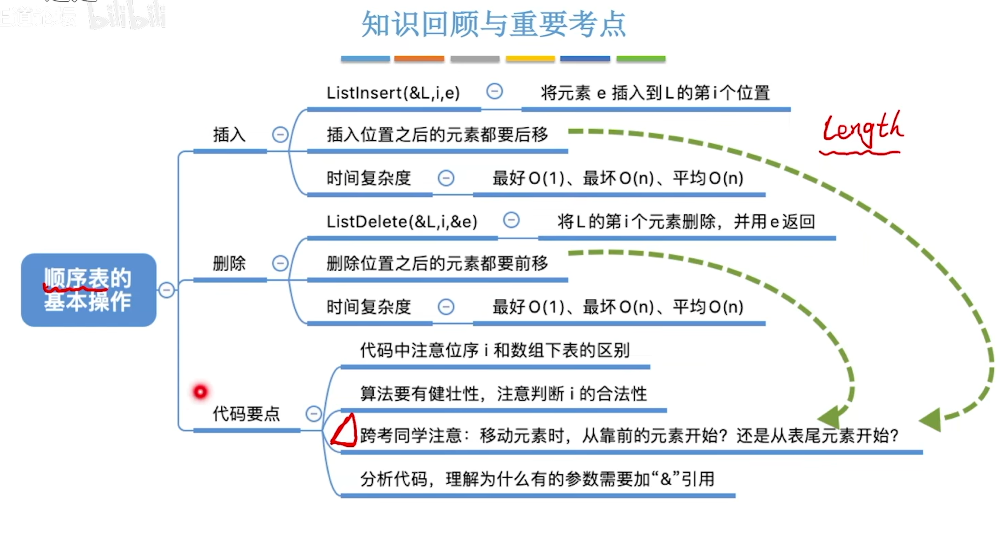
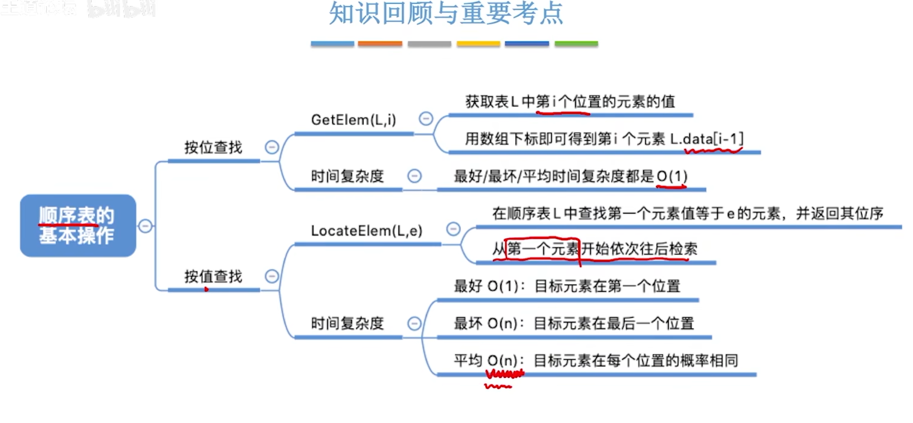
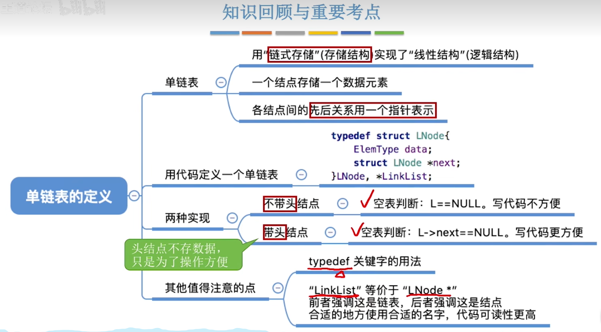

# 线性表

## 定义和基本操作





## 顺序表

### 顺序表定义和实现

 










```c
// 静态顺序表
#define MAX_SIZE 100
typedef int ElemType;

typedef struct {
    ElemType data[MAX_SIZE];
    int length;
} SeqList;

// 初始化顺序表
void InitList(SeqList* L) {
    L->length = 0;
}

// 在顺序表的第i个位置插入元素e
bool ListInsert(SeqList* L, int i, ElemType e) {
    if (L->length == MAX_SIZE) {
        printf("顺序表已满，无法插入。\n");
        return false;
    }
    if (i < 1 || i > L->length + 1) {
        printf("插入位置不合法。\n");
        return false;
    }
    for (int j = L->length; j >= i; j--) {
        L->data[j] = L->data[j - 1];
    }
    L->data[i - 1] = e;
    L->length++;
    return true;
}

// 删除顺序表的第i个元素
bool ListDelete(SeqList* L, int i, ElemType &e) {
    if (i < 1 || i > L->length) {
        printf("删除位置不合法。\n");
        return false;
    }
    e=L->data[i];
    for (int j = i; j < L->length; j++) {
        L->data[j - 1] = L->data[j];
    }
    L->length--;
    return true;
}

// 获取顺序表的第i个元素
ElemType GetElem(SeqList* L, int i) {
    if (i < 1 || i > L->length) {
        printf("位置不合法。\n");
        return 0;
    }
    ElemType e = L->data[i - 1];
    return e;
}

//获取顺序表元素的位置
int LocateElem(SeqList* L, ElemType e) {
    for (int i = 0; i < L->length; i++) {
        if (L->data[i] == e) {
            return i + 1;
        }
    }
    return 0;
}

int main(){
    SeqList L;
    InitList(&L);
    for (int i = 0; i < 10; i++) {
        ListInsert(&L, i + 1, i);
    }
    for (int i = 0; i < L.length; i++) {
        printf("L.data[%d]=%d\n",i, GetElem(&L,i+1));
    }
    ElemType e=-1;
    if (ListDelete(&L, 5, e)){
        printf("删除的元素是%d\n",e);
    } else {
        printf("删除失败\n");
    }
    for (int i = 0; i < L.length; i++) {
        printf("L.data[%d]=%d\n",i, GetElem(&L,i+1));
    }
    return 0;
}
```

```c
// 动态顺序表
typedef int ElemType;
typedef struct {
    ElemType* data; // 数据域
    int length; // 当前长度
    int capacity; // 当前容量
} DynSeqList;

// 初始化顺序表
void InitList(DynSeqList* L, int initSize) {
    L->data = (ElemType*)malloc(initSize * sizeof(int)); // 为顺序表分配内存空间
    L->length = 0; 
    L->capacity = initSize; // 初始化容量
}

// 在顺序表的第i个位置插入元素e
void ListInsert(DynSeqList* L, int i, ElemType e) {
    if (L->length == L->capacity) {
        L->capacity *= 2;
        L->data = (int*)realloc(L->data, L->capacity * sizeof(int));
    }
    if (i < 1 || i > L->length + 1) {
        printf("插入位置不合法。\n");
        return;
    }
    for (int j = L->length; j >= i; j--) {
        L->data[j] = L->data[j - 1];
    }
    L->data[i - 1] = e;
    L->length++;
}

// 删除顺序表的第i个元素
void ListDelete(DynSeqList* L, int i) {
    if (i < 1 || i > L->length) {
        printf("删除位置不合法。\n");
        return;
    }
    for (int j = i; j < L->length; j++) {
        L->data[j - 1] = L->data[j];
    }
    L->length--;
}

// 增加动态数组元素
void AddElem(DynSeqList* L, int e) {
    // printf("L->data=%d\n",L->data);
    if (L->length == L->capacity) {
        L->capacity += e;
        L->data = (int*)realloc(L->data, L->capacity * sizeof(int));
    }
    L->capacity+=e;
    L->length++;

    // if (L->capacity==L->length){
    //     int *p=L->data;
    //     L->data=(int *)malloc ((L->capacity+e)*sizeof(int));
    //     for (int i=0;i<L->length;i++){
    //         L->data[i]=p[i];
    //     }
    //     free(p);
    // }
    // L->capacity+=e;

    // printf("L->data=%d\n",L->data);
}

//查找顺序表的第i个元素
ElemType GetElem(DynSeqList* L, int i) {
    if (i < 1 || i > L->length) {
        printf("位置不合法。\n");
        return 0;
    }
    return L->data[i - 1];
}

//获取顺序表元素的位置
int LocateElem(DynSeqList* L, ElemType e) {
    for (int i = 0; i < L->length; i++) {
        if (L->data[i] == e) {
            return i + 1;
        }
    }
    return 0;
}

int main(){
    DynSeqList L;
    InitList(&L, 10);
    for (int i = 0; i < 10; i++) {
        ListInsert(&L, i + 1, i);
    }
    for (int i = 0; i < L.length; i++) {
        printf("L.data[%d]=%d\n",i, GetElem(&L,i+1));
    }
    AddElem(&L, 100);
    return 0;
}
```

代码部分来自王道 , copliot。

## 链表

### 单链表定义



```c
// 单链表
typedef int ElemType;
typedef struct LNode {
    ElemType data; // 数据域
    struct LNode* next; // 指针域
} LNode, *LinkList;

// 初始化单链表
void InitList(LinkList &L) {
    L = (LinkList)malloc(sizeof(LNode));
    if (!L) {
        printf("内存分配失败。\n");
        exit(0);
    }
    (L)->next = NULL;
}
// 判断单链表是否为空
bool Empty(LinkList L){
    return L->next==NULL;
}

// 在单链表的第i个位置插入元素e
void ListInsert(LinkList* L, int i, ElemType e) {
    if (i < 1) {
        printf("插入位置不合法。\n");
        return;
    }
    LinkList p = *L;
    int j = 0;
    while (p && j < i - 1) {
        p = p->next;
        j++;
    }
    if (!p) {
        printf("插入位置不合法。\n");
        return;
    }
    LinkList s = (LinkList)malloc(sizeof(LNode));
    s->data = e;
    s->next = p->next;
    p->next = s;
}

// 删除单链表的第i个元素
bool ListDelete(LinkList* L, int i, ElemType &e) {
    if (i < 1) {
        printf("删除位置不合法。\n");
        return false;
    }
    LinkList p = *L;
    int j = 0;
    while (p->next && j < i - 1) {
        p = p->next;
        j++;
    }
    if (!(p->next)) {
        printf("删除位置不合法。\n");
        return false;
    }
    LinkList q = p->next;
    p->next = q->next;
    e = q->data;
    free(q);
    return true;
}

// 获取单链表的第i个元素
ElemType GetElem(LinkList* L, int i) {
    LinkList p = (*L)->next;
    int j = 1;
    while (p && j < i) {
        p = p->next;
        j++;
    }
    if (!p) {
        printf("位置不合法。\n");
        return 0;
    }
    return p->data;
}

//获取单链表元素的位置

int LocateElem(LinkList* L, ElemType e) {
    LinkList p = (*L)->next;
    int i = 1;
    while (p) {
        if (p->data == e) {
            return i;
        }
        p = p->next;
        i++;
    }
    return 0;
}

int main(){
    LinkList L;
    InitList(L);
    // printf(Empty(L)?"链表为空\n":"链表不为空\n");
    for (int i = 0; i < 10; i++) {
        ListInsert(&L, i + 1, i);
    }
    for (int i = 0; i < 10; i++) {
        printf("L.data[%d]=%d\n",i, GetElem(&L,i+1));
    }
    ElemType e=-1;
    if (ListDelete(&L, 5, e)){
        printf("删除的元素是%d\n",e);
    } else {
        printf("删除失败\n");
    }
    for (int i = 0; i < 9; i++) {
        printf("L.data[%d]=%d\n",i, GetElem(&L,i+1));
    }
    return 0;
}
```

